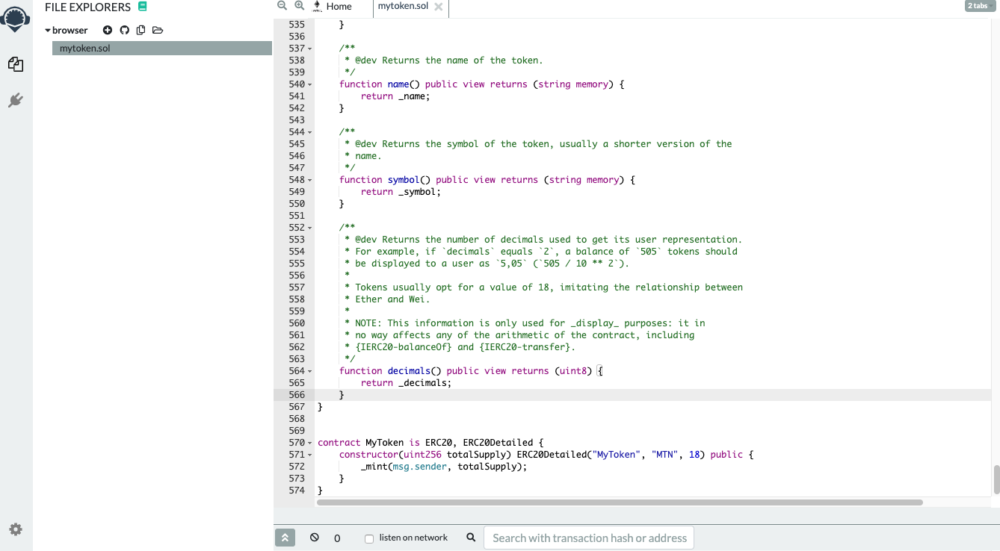
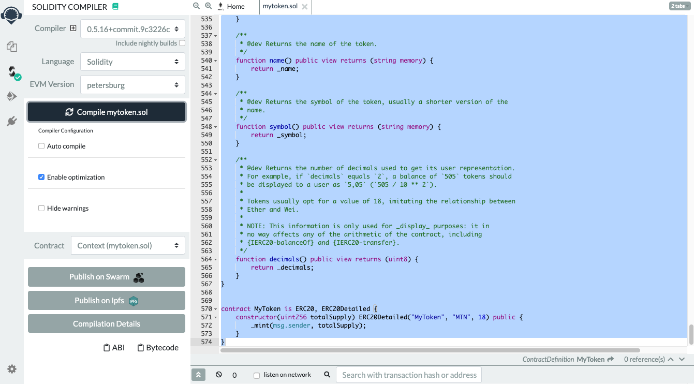
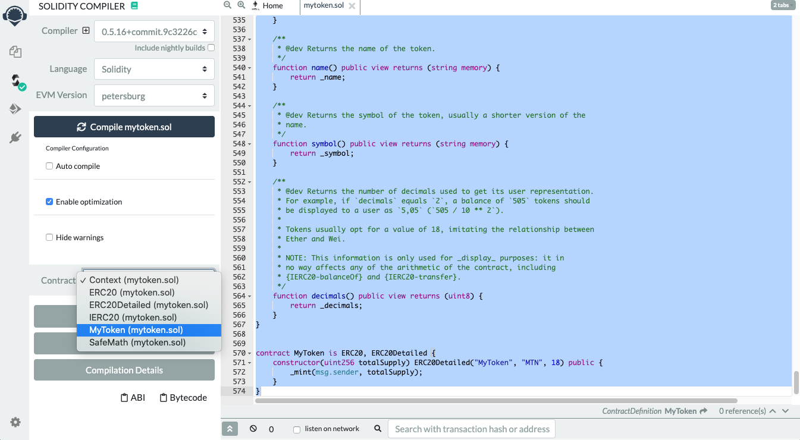
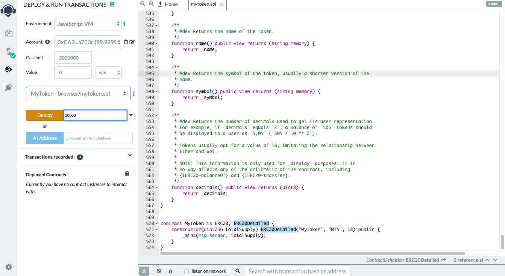
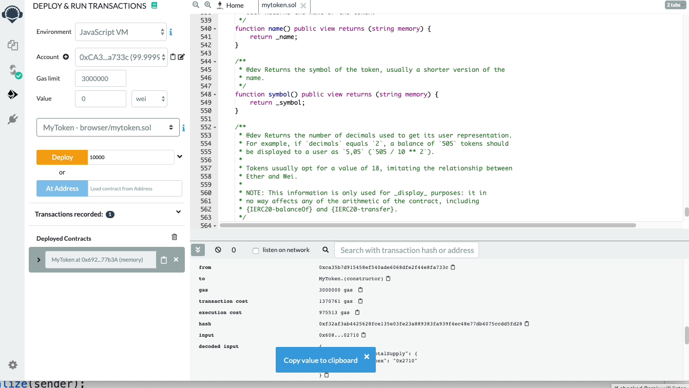
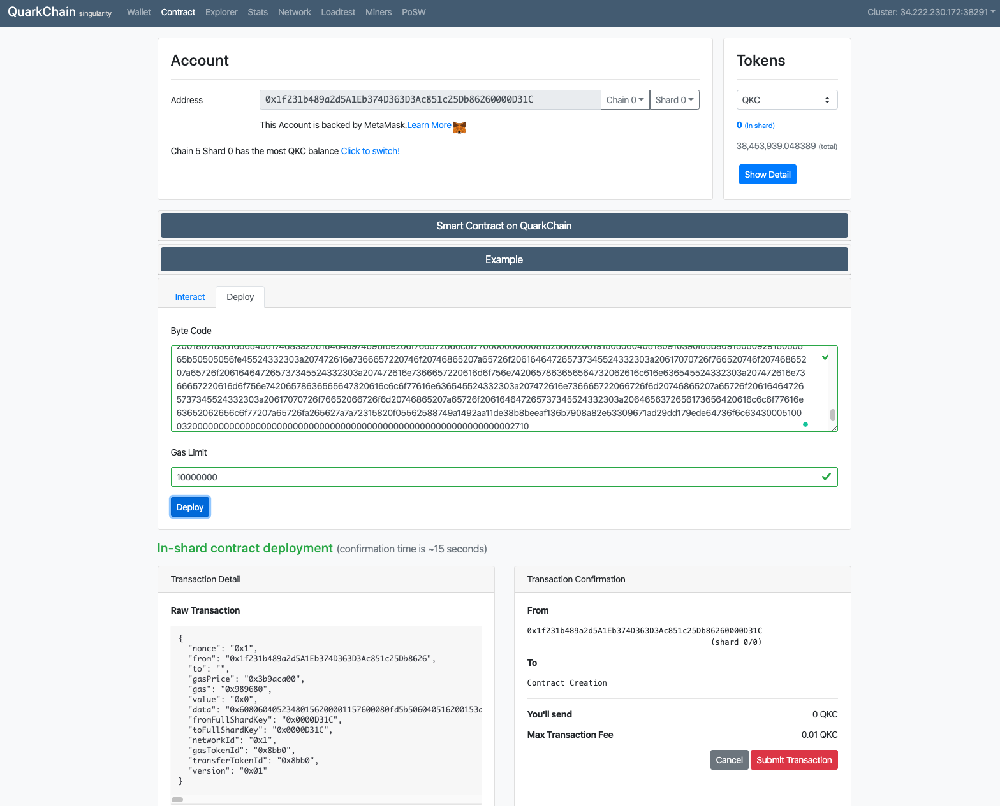
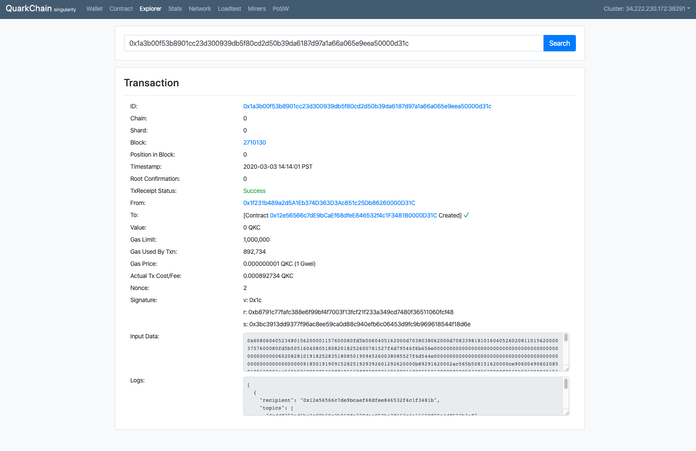
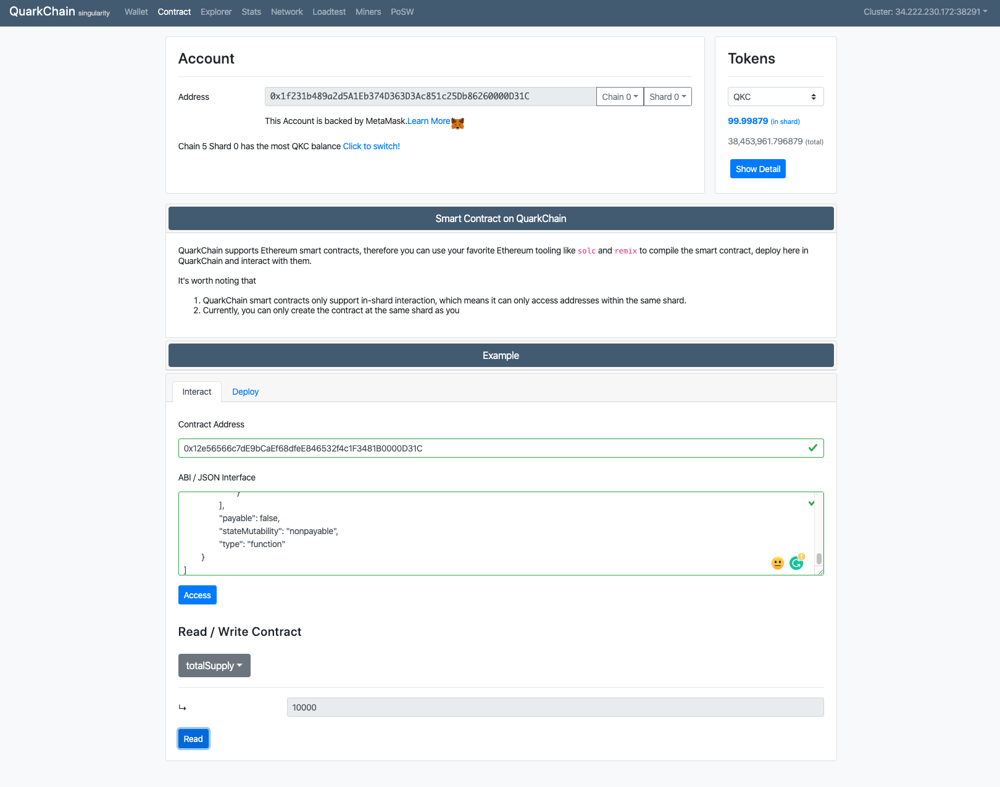

# dApp Development on QuarkChain (remix version)
In this document, we will provide a step-by-step dapp development (deployment and call) on QuarkChain.

Please note that
- Current pyquarkchain 1.3 supports EVM Petersburg.  We plan to support the latest EVM in future network upgrade.
- We assume the contract code is already ready.
For illustration purpose, we use the code here [MyToken.sol](https://gist.github.com/qizhou/7a7753df36f50cb1f05e05ed18a59af7#file-mytoken-sol) in the tutorial.

## Steps

### Step 1: Paste the code in remix.

### Step 2: Compile the code
Note that the target EVM version is set to "Petersburg".

### Step 3: Get the ABI of the code
Switch to MyToken contract and the save ABI json file.  This file will be used to access the contract.
An example ABI of the code can be found [here](https://gist.github.com/qizhou/7a7753df36f50cb1f05e05ed18a59af7#file-mytoken_abi-json)

### Step 4: Deploy the code with totalSupply as constructor parameter
Now, we deploy the code with totalSupply 10000 in remix.

### Step 5: Get the code binary
The deployed code binary can be found on the bottom-right side of remix (and click the clipboard icon of "input").
An example binary of the code can be found [here](https://gist.github.com/qizhou/7a7753df36f50cb1f05e05ed18a59af7#file-mytoken-bin)

### Step 6: Deploy the code on QuarkChain mainnet
Now, we are ready to deploy and run the code on QuarkChain mainnet.  First, we open the contract page on [QuarkChain explorer](http://http://mainnet.quarkchain.io/contract).
Switch to "Deploy" tab and paste the binary code in "Byte Code", and then sign and submit the deployment transaction.
Note that the contract will be deployed on the chain of sender (e.g., chain 0 in the example).  If you wish to deploy on different chain, simply switch to the chain id in Account tab.

### Step 7: Check the deployment status
From the figure, we could determine
- The contract is successfully deployed
- The contract address is 0x12e56566c7dE9bCaEf68dfeE846532f4c1F3481B0000D31C 

### Step 8: Access the contract
Now we are able to read/write the contract in the "Interact" tab in [QuarkChain explorer](http://mainnet.quarkchain.io/contract).

The tab will accept two parameters:
1. The contract address after the successful deployment
2. The contract ABI, which is obtained from remix in Step 3
The following shows an example that read the totalSupply from the contract.

# Q&A
## Q: After sending the deployment transaction, the transaction is failed and no contract is created.
A: This is most likely that the transaction does not have sufficient gas, and you need to retry with greater gas.  Note that you could also determine the gas of deployment in remix.

## Q: After submitting the transaction in "Contract" page, the page returns "Sending transaction failed"
A: This is most likely that the gas limit is too high.  Current QuarkChain suppports up to 6M gas limit per block, and thus any transaction with more than 6M gas limit will be failed.
